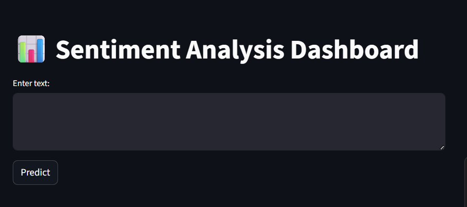
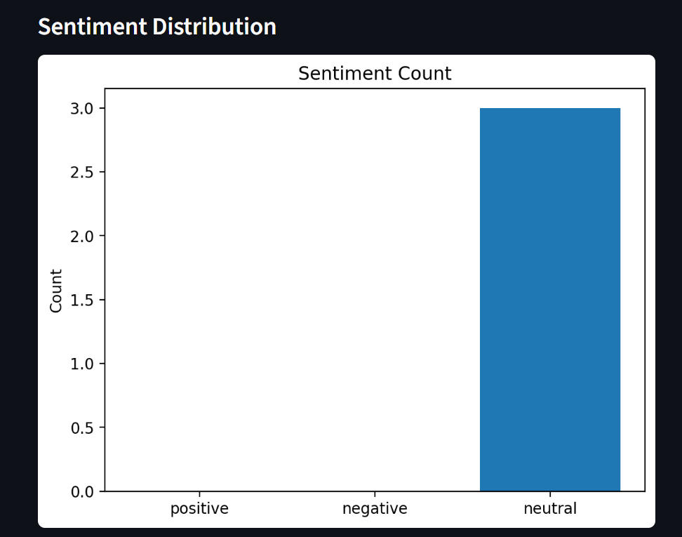

# 🚀 Social Media Sentiment Analysis Dashboard


---

## 🌐 Live Demo

👉 https://social-media-sentiment-analysis-dashboard-epzngwyud73ffg8xsryf.streamlit.app/

---

## 📌 Project Overview

The **Social Media Sentiment Analysis Dashboard** is an end-to-end Machine Learning and NLP project that analyzes textual data (like social media posts, comments, or reviews) and classifies them into:

* 😊 Positive
* 😐 Neutral
* 😡 Negative

This project simulates how companies monitor customer opinions, feedback, and brand perception in real time.

---

## 🎯 Problem Statement

Businesses receive thousands of comments and reviews daily. Manually analyzing them is:

* Time-consuming
* Inefficient
* Error-prone

This project solves the problem by **automatically detecting sentiment** using Machine Learning.

---

## 💼 Industry Use Cases

* 🛒 E-commerce (product reviews analysis)
* 🍔 Food delivery apps (customer feedback)
* 🎬 Streaming platforms (content sentiment)
* 🏦 Banking sector (customer complaints)
* 📱 Social media monitoring (brand reputation)

---

## 🧠 Tech Stack

* **Programming Language:** Python
* **Libraries:** Pandas, NumPy, Scikit-learn
* **NLP Techniques:** TF-IDF Vectorization
* **Model:** Logistic Regression
* **Visualization:** Matplotlib / Streamlit Charts
* **Frontend:** Streamlit

---

## ⚙️ Project Architecture

```
User Input (Text)
        ↓
Text Cleaning & Preprocessing
        ↓
TF-IDF Feature Extraction
        ↓
Machine Learning Model (Logistic Regression)
        ↓
Sentiment Prediction
        ↓
Streamlit Dashboard (Visualization + Insights)
```

---

## 📂 Folder Structure

```
social-media-sentiment-analysis-dashboard/
│
├── data/                 # Dataset
├── src/                  # Core ML logic
│   ├── preprocess.py
│   ├── train.py
│   ├── predict.py
│   └── create_dataset.py
│
├── models/               # Saved ML model
├── app/                  # Streamlit app
│   └── app.py
│
├── outputs/              # Graphs / results
├── images/               # Screenshots
├── README.md
├── requirements.txt
└── .gitignore
```

---

## ⚡ Installation

### Step 1: Clone Repository

```bash
git clone https://github.com/<your-username>/social-media-sentiment-analysis-dashboard.git
cd social-media-sentiment-analysis-dashboard
```

### Step 2: Create Virtual Environment

```bash
python -m venv venv
```

### Step 3: Activate Environment

**Windows:**

```bash
venv\Scripts\activate
```

**Mac/Linux:**

```bash
source venv/bin/activate
```

### Step 4: Install Dependencies

```bash
pip install -r requirements.txt
```

---

## ▶️ How to Run the Project

### 1️⃣ Create Dataset

```bash
python src/create_dataset.py
```

### 2️⃣ Train Model

```bash
python -m src.train
```

### 3️⃣ Run Streamlit App

```bash
streamlit run app/app.py
```

---

## 📊 Features

* Real-time sentiment prediction
* Supports Positive / Negative / Neutral classification
* Interactive dashboard using Streamlit
* Visual sentiment distribution graph
* Clean and modular ML pipeline

---

## 📈 Sample Output

**Input:**

```
"I love this product!"
```

**Output:**

```
Sentiment: Positive 😊
```

---

## 📸 Screenshots

### Dashboard


### Prediction


### Graph


---

## 🧪 Model Performance

* Algorithm: Logistic Regression
* Feature Engineering: TF-IDF
* Cross Validation Accuracy: ~98%

---

## 🎓 Learning Outcomes

* End-to-end ML project development
* Natural Language Processing (NLP) basics
* Text preprocessing techniques
* Model training and evaluation
* Streamlit dashboard deployment
* GitHub project structuring

---

## 🚀 Future Improvements

* Use real-time Twitter/YouTube API
* Implement Deep Learning (LSTM / BERT)
* Add multi-language sentiment detection
* Deploy using Docker / Cloud

---

## 👩‍💻 Author

**Sinchana Gowda**

* GitHub: https://github.com/sinchana4778-lang
* LinkedIn: (Add your profile link)

---

## ⭐ If you like this project

Give it a ⭐ on GitHub and share it!

---
